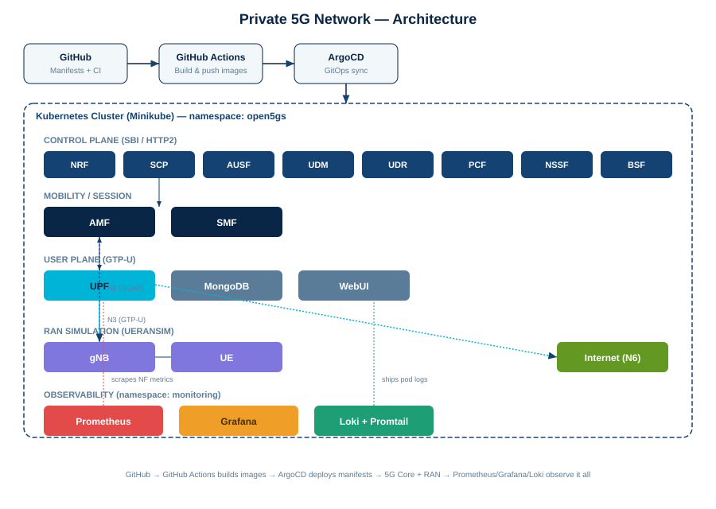

# Private 5G Network — Open5GS + UERANSIM + Kubernetes + GitOps

A complete private 5G mobile network built entirely in software: 11 Open5GS core
network functions and a UERANSIM RAN simulator, containerized and deployed on
Kubernetes, operated with GitOps (ArgoCD), and monitored with a full
Prometheus/Grafana/Loki observability stack.

**Verified outcome:** a simulated UE registers with the core, establishes a PDU
session, and sends/receives real internet traffic through the deployed data path.



## Tech Stack

| Layer | Technology |
|---|---|
| 5G Core | Open5GS v2.8.0 (built from source) |
| RAN Simulation | UERANSIM v3.2.7 |
| Orchestration | Kubernetes (Minikube) |
| Subscriber DB | MongoDB 7.0 |
| GitOps / CD | ArgoCD |
| Monitoring | Prometheus + Grafana |
| Logging | Loki + Promtail |

## Architecture

5G Core uses a Service-Based Architecture (SBA) — every network function exposes
an HTTP/2 API and discovers peers via the NRF. Deployed network functions:

`NRF · SCP · AMF · SMF · UPF · AUSF · UDM · UDR · PCF · NSSF · BSF`

Each NF is a separate Kubernetes Deployment + Service + ConfigMap, all managed
declaratively and reconciled automatically by ArgoCD from this repository.

## Repository Structure

```
private5g/
├── mongodb/ nrf/ scp/ ausf/ udm/ udr/ pcf/ nssf/ bsf/ amf/ smf/ upf/
│   └── each: configmap.yaml, deployment.yaml, service.yaml
├── webui/
├── ueransim/           # gNB + UE simulator
├── monitoring/         # Grafana dashboard ConfigMap
├── argocd/              # ArgoCD Application manifest
├── .github/workflows/   # CI: builds & pushes Docker images
├── deploy.sh / cleanup.sh
└── docs/architecture.svg
```

## Running It Yourself

```bash
minikube start --driver=docker --kubernetes-version=v1.35.1 --cpus=4 --memory=6144
eval $(minikube docker-env)
docker build -t open5gs:v2.8.0 -f Dockerfile.open5gs .
docker build -t ueransim:v3.2.7 -f Dockerfile.ueransim .
bash deploy.sh
```

Verify end-to-end:
```bash
kubectl logs deploy/ueransim-ue -n open5gs
# "Initial Registration is successful"
# "PDU Session establishment is successful"
kubectl exec -it deploy/ueransim-ue -n open5gs -- ping -I uesimtun0 -c 4 8.8.8.8
```

## Challenges Solved

Real debugging encountered building this — documented because diagnosing *why*
something failed was most of the actual engineering work.

| Issue | Root Cause | Fix |
|---|---|---|
| SMF/UPF PFCP association kept flapping | NFs advertised `0.0.0.0` as their own Node-ID to peers | Substitute real pod IP via Kubernetes Downward API at container startup |
| Registration reject `[95]`, traced across AUSF/UDM/UDR/PCF/NSSF/BSF | Same Node-ID bug, on the plain HTTP/SBI layer — one NF at a time | Applied the same pod-IP substitution to every NF's SBI config |
| gNB `RLS failure`, UE found no cell | `linkIp` set to a Kubernetes Service hostname instead of a literal IP | Radio Link Simulation needs a real bindable address |
| UPF PFCP source port silently rewritten | Standard `ClusterIP` Service NAT rewriting UDP source port | Headless Service (`clusterIP: None`) for UPF and AMF |
| WebUI `ErrImagePull` | `open5gs/open5gs-webui:latest` doesn't exist — no official image published | Used community image `gradiant/open5gs-webui:2.7.0` |
| Cluster-wide instability, pods frozen 22+ hours | Minikube silently running an unsupported Kubernetes version | Pinned explicitly: `--kubernetes-version=v1.35.1` |
UE pod crashed intermittently with Bad Inet address	Missing initContainer — UE could start before gNB's Service DNS was resolvable	Added wait-gnb initContainer; iterated through nc (fails on SCTP), nslookup (unreliable exit code with DNS search domains), to a working nslookup + output-grep check
Full troubleshooting journal: [`docs/troubleshooting.md`](docs/troubleshooting.md)

## Screenshots

| | |
|---|---|
|  |  |
|  |  |

## License

MIT
